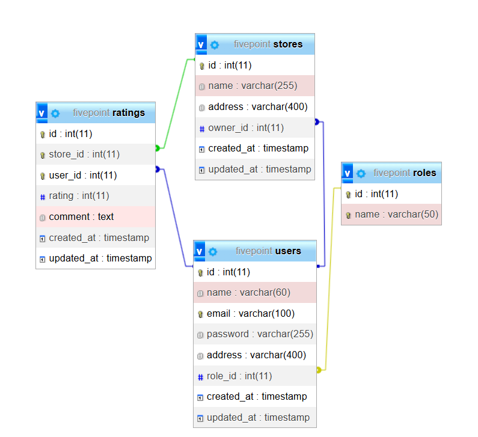

# 🛒 FivePoint Web Application

A full-stack web application that allows users to rate stores, with different functionalities available based on user roles (Admin, Store Owner, and Normal User).

## 📁 Project Structure

```

root/
│
├── backend/      # Node.js + Express.js API
├── frontend/     # React.js frontend
└── fivepoint.sql  # SQL schema for MySQL/MariaDB

````

---

## 🛠️ Tech Stack

- **Frontend:** React.js
- **Backend:** Node.js + Express.js
- **Database:** MySQL (MariaDB compatible)

---

## 🔐 User Roles & Permissions

### 1. **System Administrator**
- Can manage users and stores
- Can view dashboard stats
- Can filter and view all users/stores and ratings

### 2. **Normal User**
- Can sign up/login
- Can browse and rate stores (1–5)
- Can update their rating

### 3. **Store Owner**
- Can login
- Can view ratings of their store and average score

---

## 📌 Features

### ✅ Common Features
- Single login system
- Password update post login
- Logout functionality

### 👤 Admin Dashboard
- Total users, stores, and ratings
- Add normal/admin users
- View all users/stores with filters (Name, Email, Address, Role)
- Detailed user view (with store rating if owner)

### 🧍 Normal User
- Sign up / Login
- View & search stores
- Submit/update rating
- See personal submitted rating

### 🏪 Store Owner
- View users who rated their store
- Average store rating

---

## 🧪 Form Validation Rules

| Field    | Validation                                   |
|----------|----------------------------------------------|
| Name     | Min 20, Max 60 characters                    |
| Address  | Max 400 characters                           |
| Email    | Valid email format                           |
| Password | 8–16 chars, 1 uppercase, 1 special character |

---

## 🗂️ Database Schema

The SQL schema is located in `database.sql`. It includes:

- `users`
- `stores`
- `roles`
- `ratings`

All relationships use foreign keys with appropriate indexing and constraints.

### ER Diagram



---

## 📦 Sample Admin Credentials
> This is Admin Credentials for testing
```env
Email: test@example.com
Password: Password@123
````

---

## 🚀 Getting Started

### 1. Clone the repository

```bash
git clone https://github.com/sagardubey14/fivepoint.git
cd fivepoint
```

### 2. Setup Backend

```bash
cd backend
npm install
npm run dev
```

### 3. Setup Frontend

```bash
cd ../frontend
npm install
npm start
```

### 4. Setup Database

* Import the `database.sql` file into your MySQL/MariaDB database.
* Update DB config in `.env`.

---

## 🧠 Additional Notes

* Sorting enabled on all major tables
* Follows best practices for backend/REST API and frontend components
* Easy to extend and deploy


---

**Sagar Dubey**  
📧 [sagardubey353@gmail.com](mailto:sagardubey353@gmail.com)
